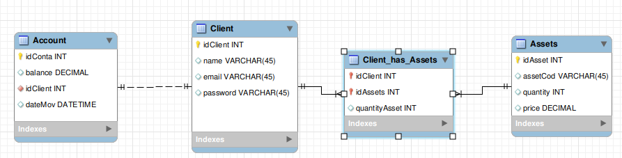
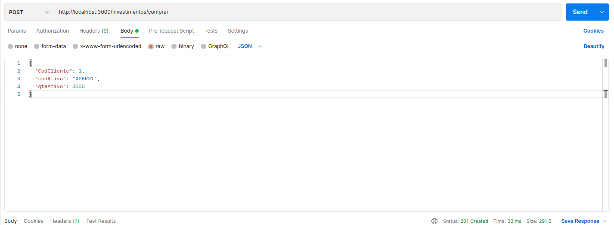

# Boas-vindas ao desafio técnico da XP para alunos da Trybe!

Aqui você vai encontrar uma breve expicação de como foi estruturado a API ao receber o desafio e como executa-lo para fazer os testes.

# Iniciando o projeto

<details>
  <summary><strong>🤷🏽‍♀️ Como iniciei o desafio técnico</strong></summary><br />

  <p>Com o desafio técnico em mãos iniciei um novo projeto no GitHub e fiz o clone para minha maquina.</p>
  Após instalar as bibliotecas que achei necessário para iniciar o projeto, descidi colocar somente a pasta node_modules no .gitignore e deixar o .env público para uma melhor avaliação do projeto desenvolvido, também preferi fazer em JavaScript pois é a linguagem de programação que eu tenho familiaridade. </p>
  <p> Com essas escolhas, iniciei modelando o banco de dados a partir do documento do desafio anotando todas as variáveis e pensando no tipo de relacionamento das tabelas, após essa modelagem cheguei no seguinte Diagrama ER</p>

  

  <p>Com o DER pronto preferi não utilizar o sequelize e utilizar a arquitetura MSC (model-service-controller), onde nas minhas model ficaram as querrys com comunicação com o Banco, no Services as regras de negocio, e no controller a resposta das requisições. Além destas 3 pastas criei mais duas pastas dentro da pasta src, a pasta de routes e a de middleware.</p>
  <p>Também criei uma pasta de testes e iniciei o projeto pensando fazer um requisito e o teste para ele, mas por perceber que estava demorando muito para finalizar os testes e o prazo estava chegando ao fim, descidi fazer toda a aplicação e depois voltar fazendo os testes de todas as camadas</p>
  <p>Durante o desenvolvimento também fiz algumas alterações que na minha percepção traria melhorias para o projeto, como por exemplo a pesquisa de ativos, e ao invés de trazer somente o saldo do cliente eu achei mais valido trazer o extrato na ordem da ação mais recente para a mais antiga</p>
  <br />
</details>

 
##  Orientações para compilar e rodar o projeto 👨‍💻
<details>
  <summary><strong>O projeto foi desenvolvido com o Docker :whale:</strong></summary><br />

  > A porta configurada no docker-compose para o `mysql` é a (`3310`) e para rodar os serviços `node` e `db` com o comando `docker-compose up -d`.
  - Esses serviços irão inicializar um container chamado `invest_xp_trybe` e outro chamado `invest_xp_trybe_db`;
  - A partir daqui você pode rodar o container `invest_xp_trybe` via CLI ou abri-lo no VS Code.

  > Use o comando `docker exec -it invest_xp_trybe bash`.
  - Ele te dará acesso ao terminal interativo do container criado pelo compose, que está rodando em segundo plano.

  > Instale as dependências [**Caso existam**] com `npm install`
  - Para rodar o projeto pode utilizar o comando `npm start` ou `npm run dev` o npm run dev roda com o nodemon

  > Após iniciar o docker e o serviço, utilizei o Workbench para ter acesso ao banco e verificar se as alterações feitas com requisição estavam sendo atualizadas
  - Para acessar o banco utilize o usuário = root e a senha = password
  - Se o banco Invest_XP_Trybe, copie o script que está na raiz do projeto com o nome invest_xp_trybe.sql e execute para criar o banco de dados.

  > Com o docker rodando e o banco criado é hora de testar, utilizei o Postman!

  ## A primeira requisição proposta foi um POST na rota `/investimentos/comprar`
  
  > No postman ou onde for testar utilize a rota `http://localhost:3000/investimentos/comprar`.
  - Passe para o corpo da requisição os seguinte objeto.
    ```json
      {
        "CodCliente": 1,
        "codAtivo": "XPBR31",
        "qteAtivo": 300
      }
    ```
    conforme o print abaixo do postman.

    
  <br/>
</details>