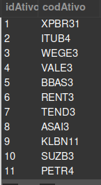
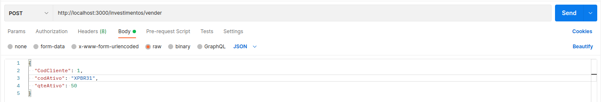
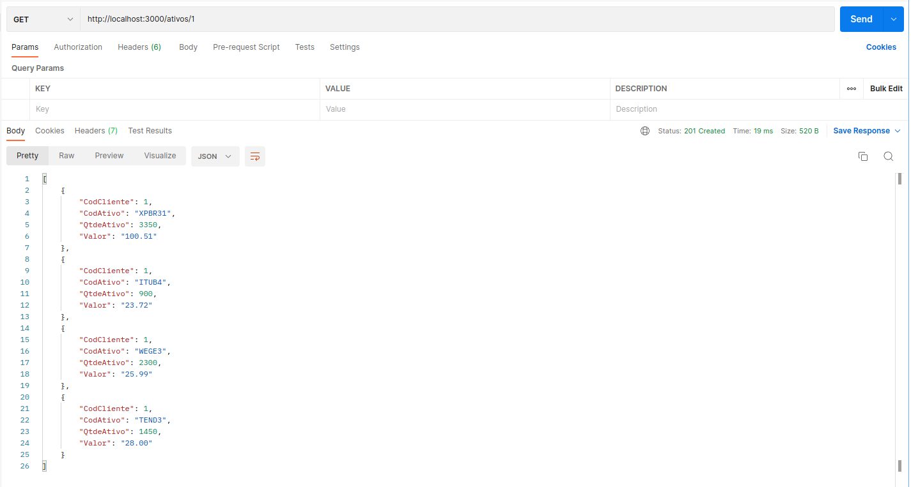
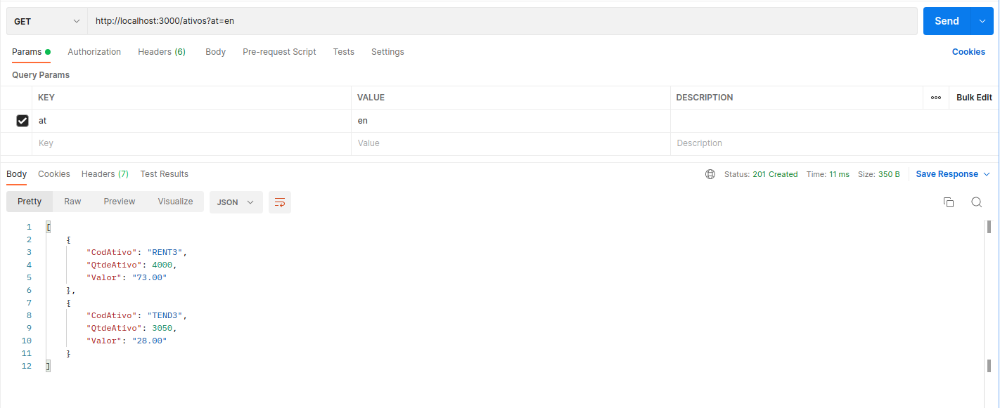
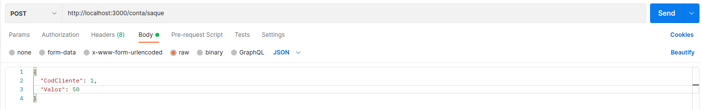
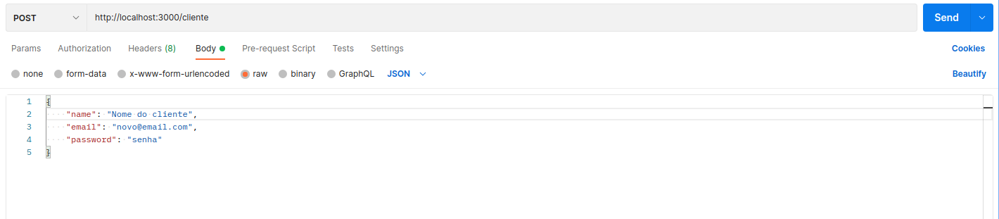

# Boas-vindas ao desafio técnico da XP para alunos da Trybe!

Aqui você vai encontrar uma breve expicação de como foi estruturado a API ao receber o desafio e como executa-lo para fazer os testes.

# Iniciando o projeto

<details>
  <summary><strong>🤷🏽‍♀️ Como iniciei o desafio técnico</strong></summary><br />

  <p>Com o desafio técnico em mãos iniciei um novo projeto no GitHub e fiz o clone para minha maquina.</p>
  Após instalar as bibliotecas que achei necessário para iniciar o projeto, decidi colocar somente a pasta node_modules no .gitignore e deixar o .env público para uma melhor avaliação do projeto desenvolvido, também preferi fazer em JavaScript pois é a linguagem de programação que eu tenho maior familiaridade. </p>
  <p> Com essas escolhas, iniciei modelando o banco de dados a partir do documento do desafio anotando todas as variáveis e pensando no tipo de relacionamento das tabelas, após essa modelagem cheguei no seguinte Diagrama ER</p> 

  

  <p>Com o DER pronto preferi não utilizar o sequelize e utilizar a arquitetura MSC (model-service-controller). As querrys mysql ficaram nas Models com comunicação com o Banco de Dados, no Services as regras de negócio, e no controller a resposta das requisições. Além destas 3 pastas criei mais duas pastas dentro da pasta src, a pasta de routes e a de middleware.</p>
  <p>Também criei uma pasta de testes e iniciei o projeto pensando fazer um requisito e testá-lo, mas por perceber que estava demorando muito devido ao prazo de entrega, decidi fazer toda a aplicação primeiro e depois voltar fazendo os testes de todas as camadas</p>
  <p>Durante o desenvolvimento também fiz algumas alterações que na minha percepção traria melhorias para o projeto, como por exemplo, a pesquisa de ativos que era proposto trazer somente uma ação, achei melhor fazer um filtro que retornasse todas as opções correspondentes ao texto digitado na URL, além disso ao invés de trazer somente o saldo do cliente achei mais válido trazer o extrato na ordem da movimentação mais recente para a mais antiga.</p>
  <br />
</details>

 
##  Orientações para compilar e rodar o projeto 👨‍💻
<details>
  <summary><strong>O projeto foi desenvolvido com o Docker :whale:</strong></summary><br />

  > A porta configurada no docker-compose para o `mysql` é a (`3310`) e para rodar os serviços `node` e `db`, utilize o comando `docker-compose up -d`.
  - Esses serviços irão inicializar um container chamado `invest_xp_trybe` e outro chamado `invest_xp_trybe_db`;
  - A partir daqui você pode rodar o container `invest_xp_trybe` via CLI ou abri-lo no VS Code.

  > Use o comando `docker exec -it invest_xp_trybe bash`.
  - Ele te dará acesso ao terminal interativo do container criado pelo compose, que está rodando em segundo plano.

  > Instale as dependências [**Caso existam**] com `npm install`
  - Para rodar o projeto pode utilizar o comando `npm start` ou `npm run dev` o npm run dev roda com o nodemon

  > Após iniciar o docker e o serviço, utilizei o Workbench para ter acesso ao banco e verificar se as alterações feitas com requisição estavam sendo atualizadas
  - Para acessar o banco utilize o `usuário = root` e a `senha = password`
  - Se o banco `Invest_XP_Trybe` não inicializar, copie o script que está na raiz do projeto com o nome `invest_xp_trybe.sql` e execute para criá-lo.

  > Com o docker rodando e o banco criado é hora de testar, no meu caso utilizei o Postman!

  > Atribuir um código de ação para o campo codAtivo ao invés de um número de ID, os códigos disponíveis estão listados abaixo:

  

  ---
  ## A primeira requisição proposta foi um POST na rota `/investimentos/comprar`
  
  > No postman ou onde for testar utilize a rota `http://localhost:3000/investimentos/comprar`.
  - Passe para o corpo da requisição o seguinte objeto.
    ```json
      {
        "CodCliente": 1,
        "codAtivo": "XPBR31",
        "qteAtivo": 300
      }
    ```
  conforme o print abaixo do postman.

  

  Se a qteAtivo for maior que a disponível na corretora é esperado a seguinte menssagem:
  ```json
  {"message": "quantity is not available"}
  ```

  ---
  ## A segunda requisição proposta foi um POST na rota `/investimentos/vender`
  
  > No postman ou onde for testar utilize a rota `http://localhost:3000/investimentos/vender`.
  - Passe para o corpo da requisição o seguinte objeto.
    ```json
      {
        "CodCliente": 1,
        "codAtivo": "XPBR31",
        "qteAtivo": 200
      }
    ```
  conforme o print abaixo do postman.

  

  Se a qteAtivo de ativo para ser vendido for maior que quantidade disponível na carteira é esperado a seguinte menssagem:
  ```json
  {"message": "there is not assets enough"}
  ```
  ---
  ## A terceira requisição proposta foi um GET na rota `/ativos/{cod-cliente}`

  > No postman ou onde for testar utilize a rota `http://localhost:3000/ativos/{:CodCliente}`, onde `{:CodCliente}` é o id do cliente, conforme o print abaixo.

  

  Se o `{:CodCliente}` passado não for de um cliente cadastrado é esperado a seguinte mensagem de erro:

  ```json
  {"message": "unregistered customer"}
  ```

  ---

  ## A quarta requisição proposta foi um GET na rota `/ativos/{cod-ativo}`

  > No postman ou onde for testar utilize a rota `http://localhost:3000/ativos?at={codAtivo}`,se utilizar a seguinte URL `http://localhost:3000/ativos?at=` o retorno será todas as ações cadastradas no banco e se passar `http://localhost:3000/ativos?at=en` o retorno será as ações que contém o `en` no código, conforme a imagem abaixo.

  

  Se o `{codAtivo}` passado não for encontrado pelo filtro é esperado a seguinte mensagem de erro:

  ```json
  {  "message": "unregistered Assets"}
  ```

  ---

   ## A quinta requisição proposta foi um POST na rota `/conta/deposito`
  
  > No postman ou onde for testar utilize a rota `http://localhost:3000/conta/deposito`.
  - Passe para o corpo da requisição o seguinte objeto.
    ```json
    {
      "CodCliente": 1,
      "Valor": 300
    }
    ```
  conforme o print abaixo do postman.

  

  Se o `Valor` for negativou ou igual a zero é esperado a seguinte menssagem:
  ```json
  {"message": "\"Valor\" must be greater than 0"}
  ```

  Se o `CodCliente` for um id que não cadastro no BD é esperado a seguinte menssagem:
  ```json
  {"message": "unregistered customer"}
  ```
  ---

   ## A sexta requisição proposta foi um POST na rota `/conta/saque`
  
  > No postman ou onde for testar utilize a rota `http://localhost:3000/conta/saque`.
  - Passe para o corpo da requisição o seguinte objeto.
    ```json
    {
      "CodCliente": 1,
      "Valor": 300
    }
    ```
  conforme o print abaixo do postman.

  

  Se o `Valor` for maior que o saldo ou negativou ou igual a zero é esperado a seguinte menssagem:
  ```json
  {"message": "\"Valor\" must be greater than 0 or your balance is insufficient"}
  ```
  ---

  ## A sétima requisição proposta foi um GET na rota `/conta/{cod-cliente}`
  
  > No postman ou onde for testar utilize a rota `http://localhost:3000/conta/{CodCliente}`, passe o `id` do cliente em  `{CodCliente}` para acessar todas as movimentações do cliente, lembrando que é apresentado um array com todas as movimentações do cliente e que o primeiro objeto é da última movimentação e com o saldo atualizado, veja o exemplo no print abaixo, onde o cliente tinha um saldo de R$850,00 e depositou R$150,00.

  

  E se o `id` passado não for  de um cliente esperado a seguinte menssagem:
  ```json
  {"message": "unregistered customer"}
  ```

  ---

  ## Rota extra para cadastrar um novo cliente - POST
  
  > No postman ou onde for testar utilize a rota `http://localhost:3000/cliente`.
  - Passe para o corpo da requisição o seguinte objeto.
    ```json
    {
      "name": "Nome do cliente",
      "email": "novo@email.com",
      "password": "senha"
    }
    ```
  conforme o print abaixo do postman.

  

  - Apesar do retorno de sucesso ser um token JWT, não fiz as validações para ele.
  
  - Se não for passado o  `name` é esperado a seguinte mensagem:
  ```json
  {"message": "\"name\" is required"}
  ```
  - Se o `email` já existir é esperado a seguinte mensagem:
  ```json
  {"message": "email is already registered, choose another email"}
  ```
  - Se não for passado o `password` é esperado a seguinte mensagem:
  ```json
  {"message": "\"password\" is required"}
  ```
  <br/>
</details>